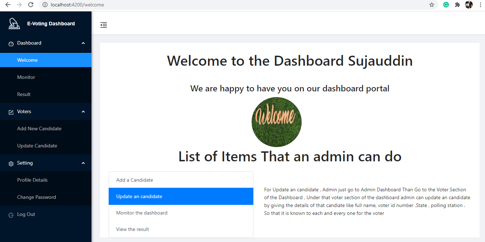

# E-voting dashboard using Angular

This project was generated with [Angular CLI](https://github.com/angular/angular-cli) version 11.2.2.

# Introduction

This is simple E-voting dashboard using Angular and NG Zorro

- Developed using boostrap-v4.0.0
- angular-v6.0.0
- angular/cli-v6.0.0
- NG Zorro
- Following the best practices.
- Ahead-of-Time compilation support.
- Official Angular i18n support.
- Production and development builds.

# How to start

1. git clone https://github.com/iamsujauddin/E-Voting-Dashboard.git
2. cd angularDashboard
3. npm install
4. ng serve --open
5. It will open  in browser

# Take a look at the dashboard template

welcome

Result

Profile

Logout

## Development server

Run `ng serve` for a dev server. Navigate to `http://localhost:4200/`. The app will automatically reload if you change any of the source files.

## Code scaffolding

Run `ng generate component component-name` to generate a new component. You can also use `ng generate directive|pipe|service|class|guard|interface|enum|module`.

## Build

Run `ng build` to build the project. The build artifacts will be stored in the `dist/` directory. Use the `--prod` flag for a production build.

## Running unit tests

Run `ng test` to execute the unit tests via [Karma](https://karma-runner.github.io).

## Running end-to-end tests

Run `ng e2e` to execute the end-to-end tests via [Protractor](http://www.protractortest.org/).

## Further help

To get more help on the Angular CLI use `ng help` or go check out the [Angular CLI Overview and Command Reference](https://angular.io/cli) page.
